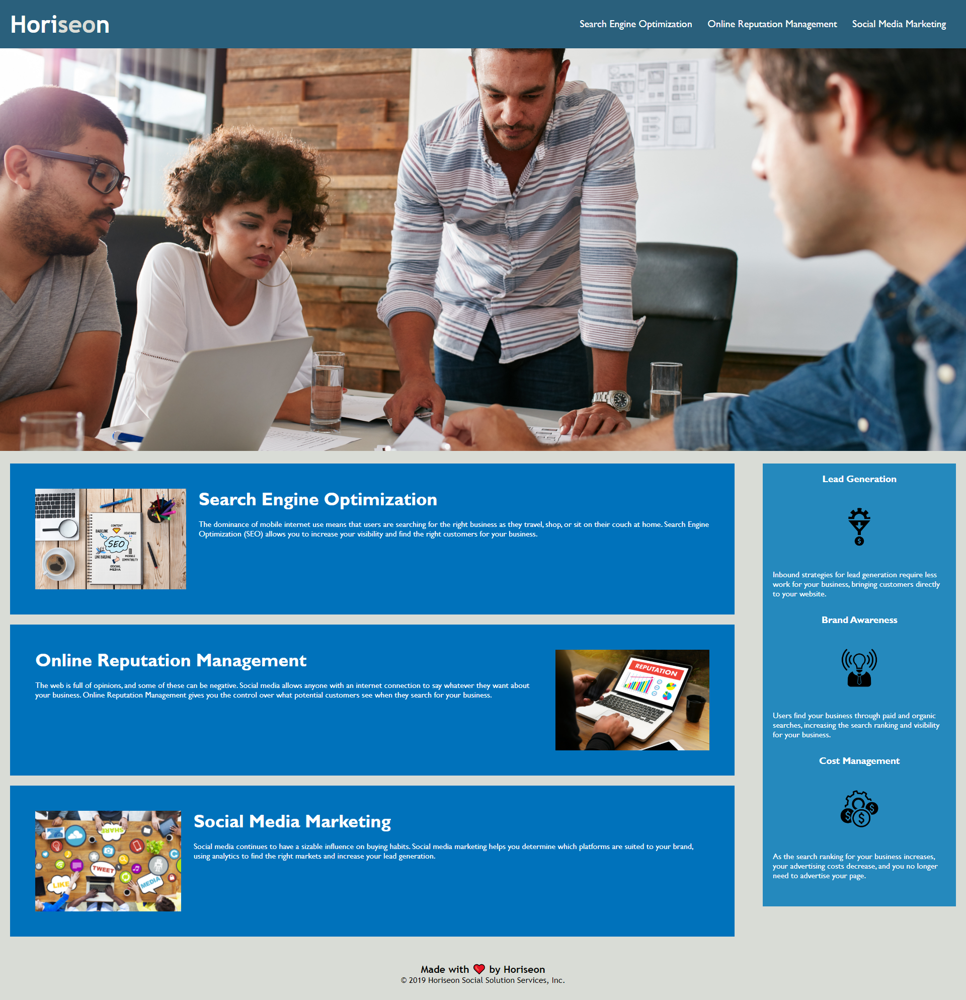

# hw1
homework 1 for UCR coding bootcamp

## Description

The purpose of this project was to improve the accesibility for users. Though the preexisting code functioned properply for users without the need for special accomodations, it was lacking for users with these needs. Also the css needed to
be streamlined because there was a numerous amounts of repeated code.


The deployed application and be found at https://jonjon276.github.io/hw1/

```md
    
    ```